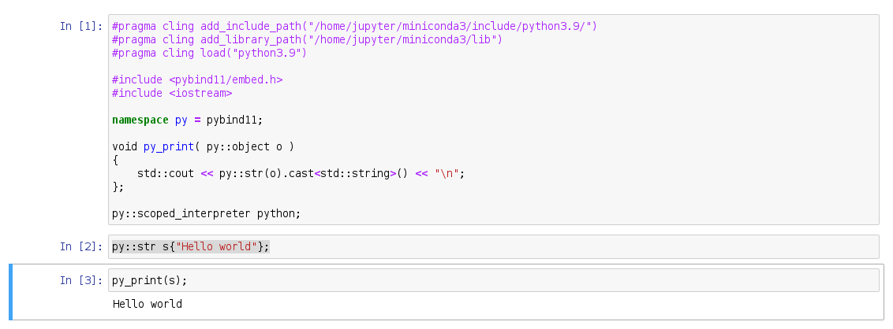
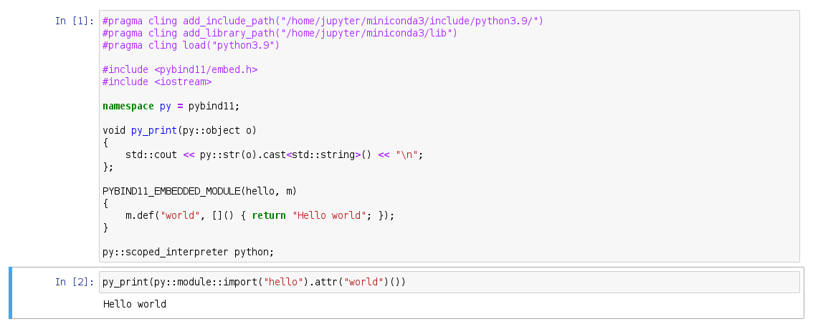

# Jupyter Notebook running pybind11 program with Xeus-Cling

## Setup
```bash
conda install -c conda-forge xeus-cling
conda install -c conda-forge pybind11
conda install -c conda-forge notebook
```

## Simple program


### The code

```c++
#pragma cling add_include_path("/home/jupyter/miniconda3/include/python3.9/")
#pragma cling add_library_path("/home/jupyter/miniconda3/lib")
#pragma cling load("python3.9")

#include <pybind11/embed.h>
#include <iostream>

namespace py = pybind11;

void py_print(py::object o)
{
    std::cout << py::str(o).cast<std::string>() << "\n";
};

py::scoped_interpreter python;

py::str s{"Hello world"};
py_print(s);
```

## Embedded module


### The code
```c++
#pragma cling add_include_path("/home/jupyter/miniconda3/include/python3.9/")
#pragma cling add_library_path("/home/jupyter/miniconda3/lib")
#pragma cling load("python3.9")

#include <pybind11/embed.h>
#include <iostream>

namespace py = pybind11;

void py_print(py::object o)
{
    std::cout << py::str(o).cast<std::string>() << "\n";
};

PYBIND11_EMBEDDED_MODULE(hello, m)
{
    m.def("world", []() { return "Hello world"; });
}

py::scoped_interpreter python;

py_print(py::module::import("hello").attr("world")());
```


## Remarks
* The buildin function `py::print()` prints into the terminal where you're running jupyter notebook, hence using custom `py_print()`. Suggestions how to redirect output of `py::print()` into the notebook are welcomed.
* Exception handling with `catch(const py::error_already_set& e)` sometimes works, sometimes not. Suggestions how to fix that are welcomed.

## Links
* [pybind11 docs](https://pybind11.readthedocs.io/)
* [pybind11 repo](https://github.com/pybind/pybind11)
* [Xeus-Cling docs](https://xeus-cling.readthedocs.io/)
* [Xeus-Cling repo](https://github.com/jupyter-xeus/xeus-cling)
